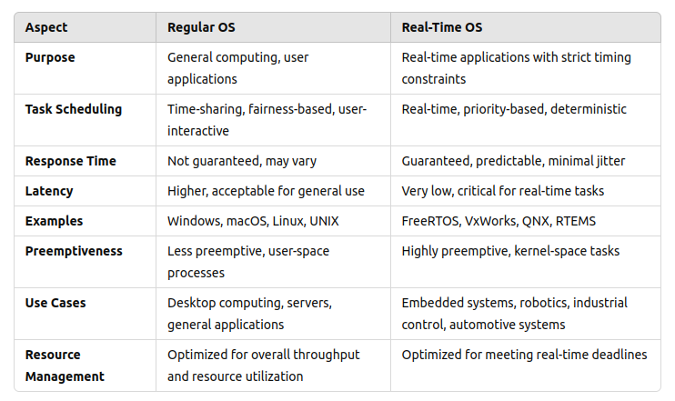
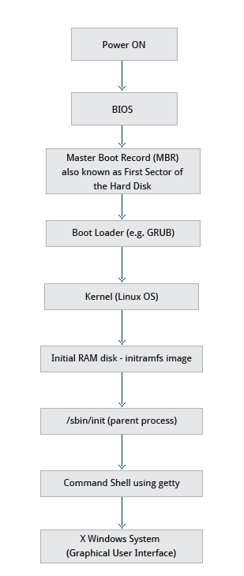

# Operating Systems

### Describe multithreading, watchdog timer, etc.

**Multithreading**: Multithreading is the ability of a program to manage its use by more than one user at a time and to even manage multiple requests by the same user without having to have multiple copies of the programming running in the computer.

**Watchdog timer**:  WDT is a piece of hardware that can be used to automatically detect software anomalies and reset the processor if any occur.

---

### What is virtual memory and caches(Also read upon Cache coherency)

- Physical memory is scarce in machines, so virtual memory is an optimization to expand that
- Memory stored in pages in hard disk and by using caches  

---

### What are priority inversion, reentrancy, spinlocks

**Priority Inversion**: lower priority task running with semaphore, higher priority is waiting for semaphore. Medium priority task interrupts, runs, and then high priority can run

- Solution is to bump priority of low priority to highest priority and then it can’t be preempted by medium (It’s called priority inheritance)

**Reentrancy**: function is reentrant when during its execution if it gets interrupted, it can return and resume function without any change

- Can’t use global/static data

**Spinlock**: a task is waiting for a certain resource that is locked and is continually checking if it opened up, using most of the CPU resources

- Good rule of thumb - avoid them in user code.

---

### What is atomic programming/non-locking operation?

Atomic operations are operations that are guaranteed to keep their values safe
Atomicity

In computer programming, an operation done by a computer is considered atomic if it is guaranteed to be isolated from other operations that may be happening at the same time. Put another way, atomic operations are indivisible.

---

### What is concurrency, parallelism and multithreading?

#### > Concurrency
- Tasks can be in progress at the same time.
- It is more about task management and scheduling.
- Used in environments where tasks interact or share resources.
- Can be achieved through multitasking, threads, or asynchronous programming.

#### > Parallelism
- Tasks are truly executed at the same time.
- Requires hardware with multiple processors or cores.
- Used in high-performance computing for speeding up computations.
- Examples include SIMD (Single Instruction, Multiple Data) and MIMD (Multiple Instruction, Multiple Data).

#### > Multithreading
- Threads are smaller units of a process.
- Threads within the same process share resources but have their own stack and registers.
- Can be used to achieve concurrency (and sometimes parallelism, if supported by the hardware).
- Commonly used to make applications more responsive (e.g., a GUI application that remains responsive while performing background tasks).

---
### Difference between Thread and Process

- A process is an independent program in execution, with its own memory space and resources. It is the basic unit of isolation in a system, ensuring that different processes do not interfere with each other.

- A thread (or lightweight process) is the smallest unit of execution within a process. Multiple threads can exist within the same process and share the same memory and resources.

---
### Mutexes and semaphores? what is the main difference between them? what is the difference between binary semaphore and mutex? how does locking happen i ln mutex?

#### > mutex
**A mutex** is a locking mechanism used to synchronize access to a resource. It ensures that only one thread can access the resource at a time. When a thread acquires a mutex, other threads attempting to acquire the same mutex will be blocked until the mutex is released.

- Ownership: Mutexes have the concept of ownership. Only the thread that locked the mutex can unlock it.
- Binary State: A mutex is either locked or unlocked.
- Usage: Typically used to protect critical sections of code that should not be executed by more than one thread at a time.

#### > Semaphores
A semaphore is a signaling mechanism used to control access to a resource. It can be used to manage access to a resource pool rather than a single resource.

- Counting: Semaphores can have a value greater than one, allowing multiple threads to access the same resource up to a certain limit.
- No Ownership: Semaphores do not have ownership. Any thread can signal (release) the semaphore.
- Usage: Often used for controlling access to a limited number of instances of a resource (e.g., a fixed number of connections).

---

### What is thrashing? what is excessive paging?

**Thrashing** is a condition in a computer system where the system spends a significant amount of time swapping data between the main memory (RAM) and the disk (paging or swapping), rather than executing actual processes. This happens when there is insufficient memory to hold all the active processes and their data, causing excessive paging. As a result, system performance degrades dramatically because the CPU is mostly busy handling page faults rather than executing the program code.

**Excessive paging** occurs when the system frequently moves pages of data between the physical memory and the disk. It is a key contributor to thrashing. When a process tries to access a page that is not in the main memory (a page fault), the operating system must fetch this page from the disk, which is significantly slower than accessing data from RAM. If this happens too often, it can lead to excessive paging.

---

### What is dynamic loading? what is static loading? when to use dynamic loading? what are the advantages? give an example when to use dynamic loading?

- Dynamic loading is a method where a program loads a module or a library into memory at runtime rather than at the start of execution. This allows for more flexible and efficient use of memory, as modules are only loaded when needed.

- Static loading is the method where all modules or libraries required by a program are loaded into memory at the start of execution. This includes linking all dependencies during the compile time, creating a single executable that contains all necessary code.
---

### Difference between regular OS and real-time OS

---
### what happens in the background from the time you press the Power button until the Linux login prompt appears?

